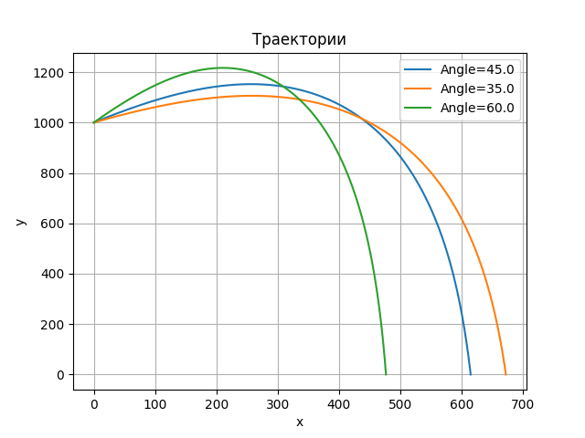

### Моделирование полёта тела в атмосфере

**Задание:**  
Реализовать приложение для моделирования полёта тела в атмосфере.  
Предусмотреть возможность ввода шага моделирования и вывода результатов.

Выполнить моделирование **без очистки предыдущих результатов** для различных шагов моделирования, сравнить траектории и заполнить таблицу:

| Шаг моделирования, с | 1 | 0.1 | 0.01 | 0.001 | 0.0001 |
|----------------------|---|-----|------|-------|--------|
| Дальность полёта, м | 526.2  |  606.1   |  613.8    |    614.5   |     614.6   |
| Максимальная высота, м | 1101.3 | 1147.4 | 1152.1 | 1152.6 | 1152.6 | 
| Скорость в конечной точке, м/с | 70.8 | 70.7 | 70.7 | 70.7 | 70.7 |

**Выводы:**
1) Шаг моделирования влияет на точность расчетов. С уменьшением шага увеличивается дальность полета, а также решение сходится к единому значению. 
2) В зависимости от выбора угла меняется максимальная высота, дальность полета, при прочих равных условиях. 
3) Размер объекта влияет на дальность полета, максимальную высоту. С увеличением размера объекта уменьшается дальность полета, при прочих равных условиях. 
4) При увеличении массы объекта увеличивается дальность полета, при прочих равных условиях. Что обусловлено меньшим сопротивлением воздуха.
5) При увеличении размера объекта уменьшается дальность полета, при прочих равных условиях.

- Демонстрация зависимости от шага моделирования:

- Демострация зависимости дальности полета от угла:

- Демонстрация зависимости дальности полета от массы, кг:

- Демонстрация зависимости дальности полета от размера, м^2:

