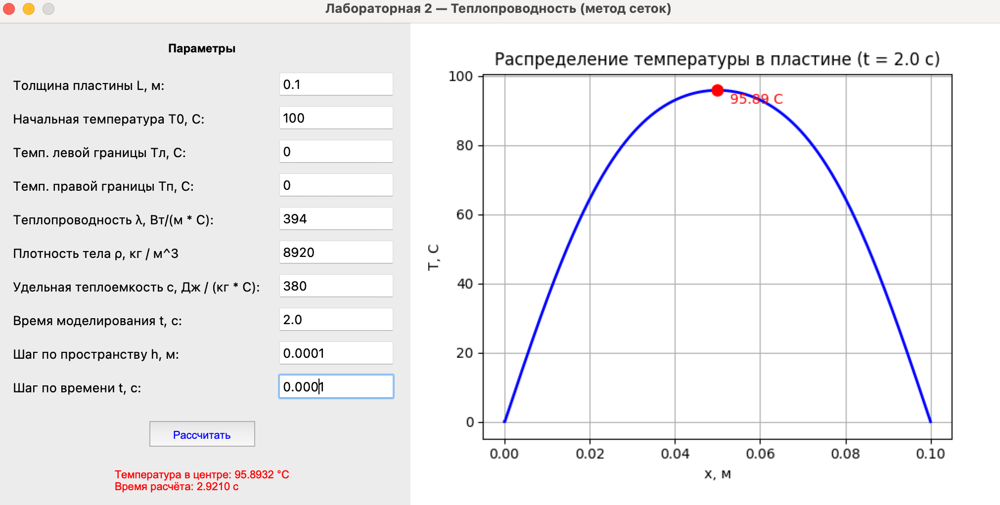

### Метод конечных разностей для уравнения теплопроводности

**Задание:**  
Реализовать моделирование изменения температуры в пластине на основе одномерного уравнения теплопроводности с использованием метода конечных разностей.

Выполнить моделирование с различными шагами по времени и по пространству.  
Заполнить таблицу значений температуры в центральной точке пластины после 2 секунд модельного времени.

| Шаг по времени, с \ Шаг по пространству, м | 0.1 | 0.01 | 0.001 | 0.0001 |
|-------------------------------------------|-----|------|-------|--------|
| 0.1 | 0.0 | 0.0 | 0.0 | 0.0 |
| 0.01 | 90.34 | 90.53 | 90.55 | 90.55 |
| 0.001 | 95.29 | 95.60 | 95.63 | 95.64 |
| 0.0001 | 95.54 | 95.85 | 95.88 | 95.89 |

**Вывод.**
- Высокая точность вычислений достигается уменьшением шага по пространству и шага по времени. 
- При следующих вводных параметрах (Медь):
  - Начальная температура: 100 C
  - Температура на границах: 0 C
  - Толщина материала: 0.1 м.
  - Теплопроводность: 394 Вт/(м*К)
  - Удельная теплоемкость: 380 Дж/(м^3 * К)
  - Плотность тела: 8920 кг / м^3
- Можно сделать вывод с точки зрения физики процесса: За 2 секунды моделируемого времени тело едва успевает остыть.

