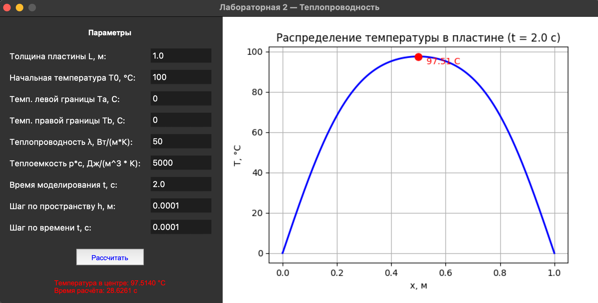

### Метод конечных разностей для уравнения теплопроводности

**Задание:**  
Реализовать моделирование изменения температуры в пластине на основе одномерного уравнения теплопроводности с использованием метода конечных разностей.

Выполнить моделирование с различными шагами по времени и по пространству.  
Заполнить таблицу значений температуры в центральной точке пластины после 2 секунд модельного времени.

| Шаг по времени, с \ Шаг по пространству, м | 0.1 | 0.01 | 0.001 | 0.0001 |
|-------------------------------------------|-----|------|-------|--------|
| 0.1 | 92.87 | 93.08 | 93.1 | 93.11 |
| 0.01 | 96.98 | 97.28 | 97.31 | 97.31 |
| 0.001 | 97.16 | 97.46 | 97.49 | 97.49 |
| 0.0001 | 97.18 | 97.47 | 97.51 | 97.51 |

**Вывод.**
- Высокая точность вычислений достигается уменьшением шага по пространству и шага по времени. 
- При следующих вводных параметрах:
  - Начальная температура: 100 C
  - Температура на границах: 0 C
  - Толщина материала: 1.0 м.
  - Теплопроводность: 50 Вт/(м*К)
  - Теплоемкость p*c: 5000 Дж/(м^3 * К)
- Можно сделать вывод с точки зрения физики процесса: За 2 секунды моделируемого времени тело едва успевает остыть - металл плохо проводит тепло в таких масштабах.

